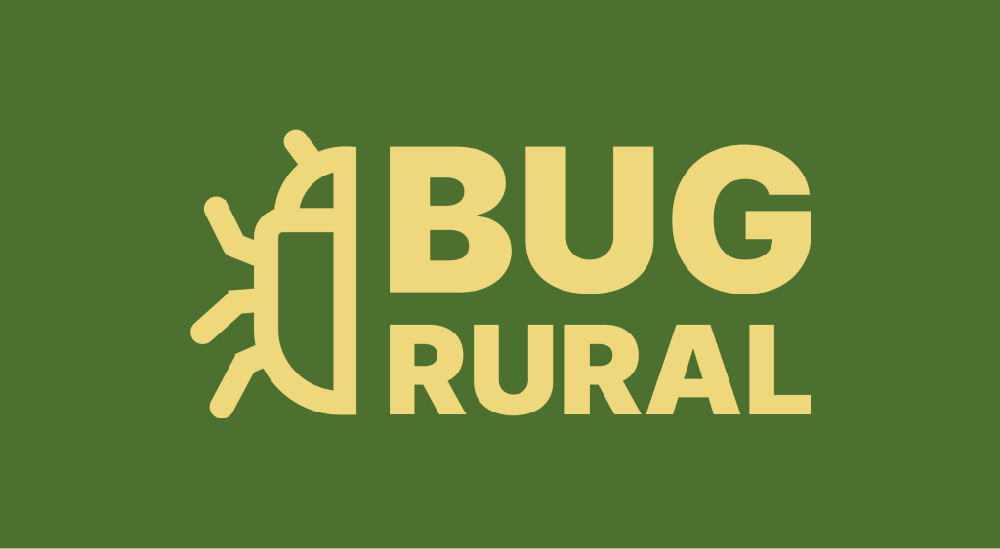

# BugRural

BugRural é uma aplicação móvel desenvolvida em Flutter que auxilia na gestão de propriedades rurais, focando especialmente no monitoramento e controle de pragas.

## Funcionalidades

- **Dashboard**: Exibe um painel de controle com informações gerais da propriedade.
- **Detalhes da Propriedade**: Visualize detalhes específicos de cada propriedade, incluindo nome, localização e proprietário.
- **Monitoramento de Pragas**: Veja o status das armadilhas de pragas na propriedade.
- **Monitoramento Climático**: Acompanhe em tempo real as variáveis climáticas na propriedade.
- **Informações de Pragas**: Veja detalhes completos sobre cada armadilha.

## Como Executar

1. Clone o repositório:

```shell
git clone https://github.com/seu_usuario/bugrural.git
cd bugrural
```

2. Instale as dependências:

```shell
flutter pub get
```

3. Execute o aplicativo:

```shell
flutter run
```

## Personalização

Você pode personalizar o aplicativo editando os arquivos em `lib/` para alterar a lógica e os layouts das telas. As imagens podem ser substituídas por suas próprias em `assets/images/`.

## Contribuição

Se desejar contribuir com este projeto, sinta-se à vontade para abrir uma issue ou enviar um pull request.

1. Fork o Repositório
2. Crie um Branch para sua Feature (`git checkout -b feature/sua-feature`)
3. Commit suas alterações (`git commit -m 'Adicionei minha feature'`)
4. Push para o Branch (`git push origin feature/sua-feature`)
5. Abra um Pull Request

## Licença

Este projeto está licenciado sob a licença MIT. Veja o arquivo LICENSE para mais detalhes.

<hr/>

Desenvolvido por José Ferreira.